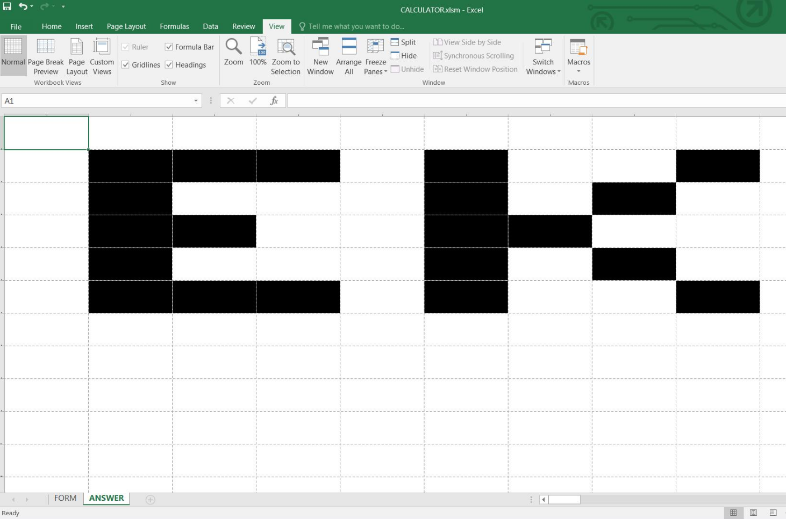

#EKOPARTY CTF 2016: Forensics 50

###Certified Excel Hacker
```
Can you wait for the answer?

Hint
Do not wait for it, it is already there :)

Attachment
for50_ed4b8625b6be1bd0.zip
```

##Solution
Given an excel with macro file, with a VBA program.
The whole file is protected, you can't read or edit anything.
At first I was misled by the file itself and try to reverse the program, and then I noticed the file has a hidden sheet named ANSWER.
The file is protected, so I can't view it, but doing some trick will help.

```
1) change the .xlsm file to .zip
2) find the file workbook.xml in CALCULATOR/xl/ directory
```
notice that there is a line
```
<sheet r:id="rId2" sheetId="2" name="ANSWER" state="hidden"/>
```
```
3) remove state="hidden" and save the file
4) change the file extension back to .xlsm
5) open the file and go the the hidden sheet
6) read the flag :D
```



The "flag" is too big :O

Flag:
>EKO{HIDDEN_SHEET_123}
