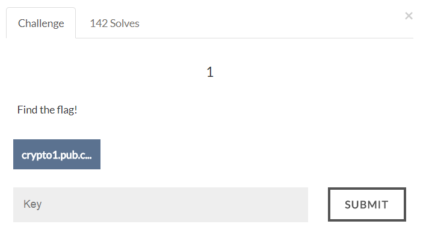

# AIS3 Pre-exam 2017: crypto1



## Solution
The given .cpp file contains the information how the flag is encrypted.
Constraint:
1.	val1 and val2 are 9 digits numbers, val3 is 7 digits number, val4 is 6 digits number.
2.	Flag has format "AIS3{...}".
3.	Every 4 bytes of flag will xor with val1, val2, val3, val4.
I use Z3 to solve this.

```python
#!/usr/bin/env python

from z3 import *

output = [964600246, 1376627084, 1208859320, 1482862807, 1326295511, 1181531558, 2003814564]

value = [BitVec("val_%d" % i, 32) for i in range(4)]
input = [BitVec("flag_%d" % i, 32) for i in range(28)]

s = Solver()
for i in range(28):
    s.add(input[i] <= 255)
    s.add(input[i] >= 0)

s.add(value[0] >= 100000000)
s.add(value[0] < 1000000000)
s.add(value[1] >= 100000000)
s.add(value[1] < 1000000000)
s.add(value[2] >= 1000000)
s.add(value[2] < 10000000)
s.add(value[3] >= 100000)
s.add(value[3] < 1000000)

s.add(input[0] == ord('A'))
s.add(input[1] == ord('I'))
s.add(input[2] == ord('S'))
s.add(input[3] == ord('3'))
s.add(input[4] == ord('{'))
s.add(input[27] == ord('}'))

for i in range(7):
    s.add(((((((input[i * 4 + 3] << 8) + input[i * 4 + 2]) << 8) + input[i * 4 + 1]) << 8) + input[i * 4]) ^ value[0] ^ value[1] ^ value[2] ^ value[3] == output[i])

if s.check() != sat:
    print "unsat"
else:
    m = s.model()
    print m

    print repr("".join([chr(m[input[i]].as_long()) for i in range(28)]))
```

Flag:
>AIS3{A XOR B XOR A EQUALS B}
