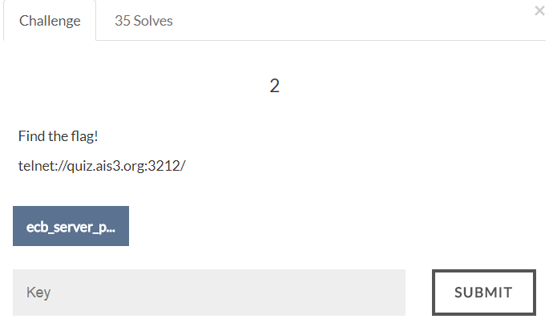

# AIS3 Pre-exam 2017: crypto2



## Solution
ECB mode is vulnerable to cut-and-paste attack.
Create the following 2 tokens:

```
WaCbgzB5casnMjNn9it0XHbiZG+MMKzhqikg4Ha79Q/HMInNZSfaaqg5mUBTSmYm
name=aaaaa&role=	< ***
student&password
=a

vZ4rNRpfpwFZUP83L5JigaFla42tcnIFcK3CMGGtQdl4barz/MSjEPFJmVm3oPeT
name=aaaaaaaaaaa
admin&role=stude	< ***
nt&password=a		< ***
```

Now combine the marked one and we can create our own token with admin role.
Then login and get the flag.

```
WaCbgzB5casnMjNn9it0XKFla42tcnIFcK3CMGGtQdl4barz/MSjEPFJmVm3oPeT
name=aaaaa&role=
admin&role=stude
nt&password=a
```

Flag:
>ais3{ABCDEFGHIJKLMNOPQRSTUVWXYZZZZZZZ}
