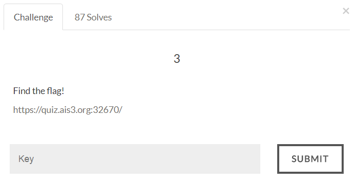

#AIS3 Pre-exam 2017: crypto3



##Solution
SHA1 collision, we can use the 2 collision files provided by Google to pass this stage.

```python
#!/usr/bin/env python

import requests
import hashlib
import string
import itertools

def sha1(content):
    Hash = hashlib.sha1()
    Hash.update(content)
    return Hash.digest()

url = 'https://quiz.ais3.org:32670/'

pdf1 = open("shattered-1.pdf").read()[:330]
pdf2 = open("shattered-2.pdf").read()[:330]

if sha1(pdf1) == sha1(pdf2):
	print 'FOUND'
	headers = {'User-Agent' : 'Mozilla/5.0'}
	values = {'username' : pdf1, 'password' : pdf2}
	session = requests.Session()
	print session.post(url, headers=headers, data=values).text.encode("utf-8")
```

Flag:
>AIS3{SHA1111l111111_is_broken}
