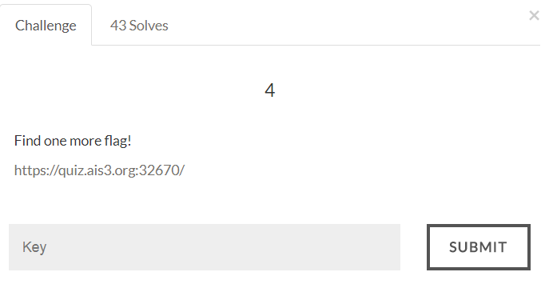

#AIS3 Pre-exam 2017: crypto4



##Solution
For the next stage, we have to give "username" and "password" under this constraints:
1.	"username" must contains "Snoopy_do_not_like_cats_hahahaha"
2.	"password" must contains "ddaa_is_PHD"
3.	The hash value must start with "f00d"

Again, use the 2 collision files to create payload. But now we have to add some additional text and brute force until we get the hash value start with "f00d".

```python
#!/usr/bin/env python

import requests
import hashlib
import string
import itertools

def sha1(content):
    Hash = hashlib.sha1()
    Hash.update(content)
    return Hash.digest()

url = 'https://quiz.ais3.org:32670/'

pdf1 = open("shattered-1.pdf").read()[:330]
pdf2 = open("shattered-2.pdf").read()[:330]

addConstraint = 'Snoopy_do_not_like_cats_hahahaha' + 'ddaa_is_PHD'

pdf1 += addConstraint
pdf2 += addConstraint

for i in itertools.product(string.letters, repeat = 20):
	temp1 = pdf1 + ''.join(i)
	temp2 = pdf2 + ''.join(i)
	if sha1(temp1) != sha1(temp2):
		print 'ERROR'
		break
	if sha1(temp1).encode('hex')[:4] == 'f00d':
		print 'FOUND!!!!'
		headers = {'User-Agent' : 'Mozilla/5.0'}
		values = {'username' : temp1, 'password' : temp2}
		session = requests.Session()
		print session.post(url, headers=headers, data=values).text.encode("utf-8")
		break
```

Flag:
>AIS3{Any_limitation_can_not_stop_me!!!!!l!!!!}
