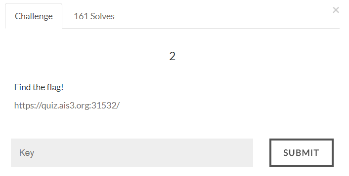
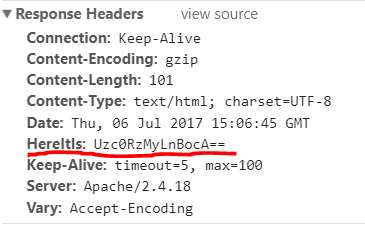
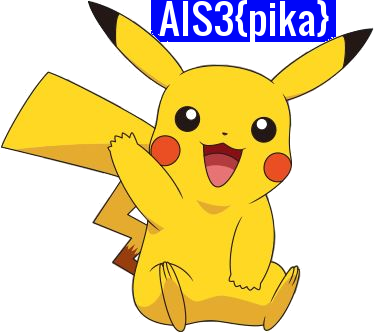

#AIS3 Pre-exam 2017: misc2



##Solution
The source code contains a commented line which turn out to be a misdirection.
```html
I've sent you something :)<html>
<body>
		<!---->
</body>
</html>
```

However, its response header contains some information.


A strange header "HereItIs" is added, which is encoded using base64.
```
Uzc0RzMyLnBocA== -> S74G32.php
```
Now we go to /S74G32.php page and get one cute pikachu picture.
	

And that picture contains flag (Left one is the original picture, I edited the picture for better view).

Flag:
>AIS3{pika}
