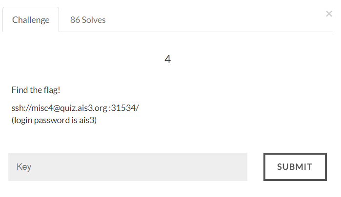

# AIS3 Pre-exam 2017: misc4



## Solution
Connect to the ssh server and we have a bash with limited function.
It has 3 files: flag, shell.c, shell
We don't have permission to read flag, but we can execute the binary to perform system().
However that binary will filter some text and only limited bash function can be used. (check shell.c)
Now we have to bypass it.

```
> ./shell "read a; read b; read c; \$a \$b; cat \$c"
read a; read b; read c; $a $b; cat $c
export
PATH=/usr/local/sbin:/usr/local/bin:/usr/sbin:/usr/bin:/sbin:/bin:/usr/games:/usr/local/games
flag
ais3{I_AM_NOT_FAMALIAR_WITH_IT}
```

Flag:
>ais3{I_AM_NOT_FAMALIAR_WITH_IT}
