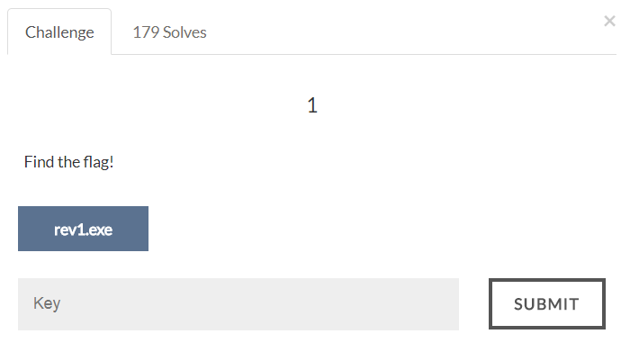
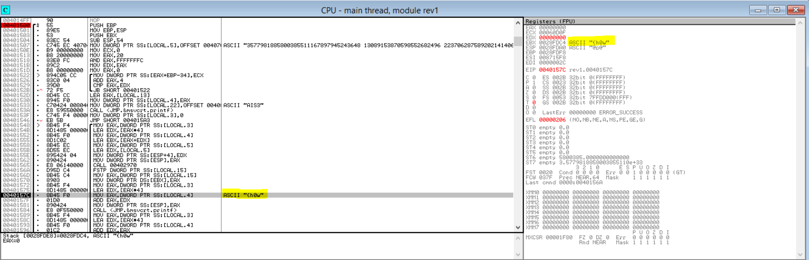

# AIS3 Pre-exam 2017: rev1

## Solution
I use ollydbg to reverse the binary.
There is a _print_flag function in the binary, which execute secretly but not printed out.
So use ollydbg to jump to that function (0x401500) and we can see the flag.
Here is the first 4 bytes of the flag:

Flag:
>AIS3{h0w d1d y0u s3e it}
