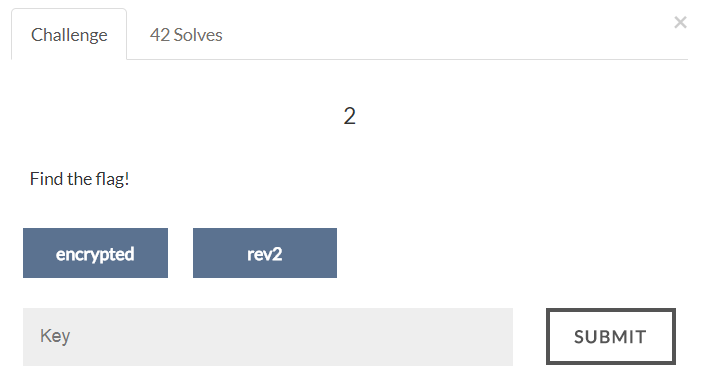

# AIS3 Pre-exam 2017: rev2



## Solution
The binary uses srand(time(0)), which is a random generator and can be guessed if we know what the seed is.
The binary says it execute the program at UTC+8 2017/6/26, so we know the seed is around UTC+8 2017/6/26 to UTC+8 2017/6/27 (Unix time: 1498406400 ~ 1498492800)
Brute force to find the correct seed (which is 1498422148), then we can decrypt the flag.

```C
#include <stdio.h>
#include <stdlib.h>

int main()
{
    FILE *stream;
    char *flag;
    size_t fsize;
    int seed;
    int i;

    char *guess = "ais3{??????????????????}";

    stream = fopen("flag", "rb");

    fseek(stream, 0, SEEK_END);
    fsize = ftell(stream);
    rewind(stream);

    flag = (char *)malloc(sizeof(char) * fsize);
    fread(flag, 1, fsize, stream);
    fclose(stream);

    int seed_found = 0;

    for(seed = 1498406400; seed <= 1498492800; seed++)
    {
        srand(seed);
        for(i = 0; i < 5; i++)
        {
            int t1 = guess[i];
            int t2 = rand();
            char tmp = t1 ^ t2;
            if(tmp != flag[i])
                break;
            if(i == 4)
            {
                printf("seed: %d\n", seed);
                seed_found = 1;
            }
        }
        if(seed_found == 1)
            break;
    }

    srand(seed);
    for(i = 0; i < fsize; i++)
    {
        int t1 = flag[i];
        int t2 = rand();
        char tmp = t1 ^ t2;
        printf("%c", tmp);
    }
    printf("\n");

    free(flag);
    return 0;
}
```

Flag:
>ais3{5m411_R4N93~_345Y~}
