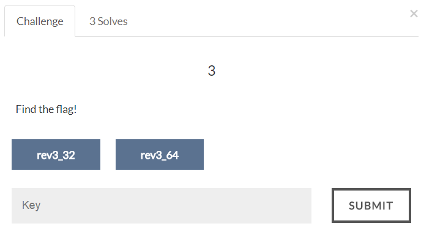

# AIS3 Pre-exam 2017: rev3



## Solution
This challenge is fun :D
The binary first ask for 17 inputs, then perform a lot of operations.
It will decrypt the flag if you give the correct inputs.

Reversing:
1.  The flag is in format `ais3{...}`.
2.  The length of the flag is 25, but we are only asked for 17 inputs, there are some inputs already given and saved as global.
3.  The encrypted flag is also given.
4.  `0 < input[i] <= 25 for all 0 <= i < 25`
5.  All the input should have different value, which means `input[i] != input[j] for i != j`.
6.  Adding 5 of the inputs (in some way, please refer to script) should have the same value.
7.  `input[6] - input[16] + input[24] - input[8] + input[18] - input[20] + input[0] - input[4]` must equal to 0.

I use Z3 to solve this challenge.

```
#!/usr/bin/env python

from z3 import *

flag = [112, 126, 119, 57, 112, 81, 90, 101, 109, 124, 94, 116, 98, 127, 111, 109, 81, 33, 109, 55, 46, 49, 104, 125, 116]

input = [BitVec("input_%d" % i, 8) for i in range(25)]

s = Solver()

for i in range(25):
    s.add(input[i] > 0)
    s.add(input[i] <= 25)

s.add(input[0] == 17)  # 'a' ^ flag[0]
s.add(input[1] == 23)  # 'i' ^ flag[1]
s.add(input[2] == 4)   # 's' ^ flag[2]
s.add(input[3] == 10)  # '3' ^ flag[3]
s.add(input[4] == 11)  # '{' ^ flag[4]
s.add(input[7] == 6)   # global
s.add(input[9] == 18)  # global
s.add(input[10] == 1)  # global
s.add(input[18] == 21) # global
s.add(input[19] == 2)  # global
s.add(input[21] == 16) # global
s.add(input[24] == 9)  # '}' ^ flag[24]

for i in range(25):
    for j in range(25):
        if i == j:
            continue
        s.add(input[i] != input[j])

for i in range(5):
    for j in range(5):
        if i == j:
            continue
        s.add((input[i * 5 + 0] + input[i * 5 + 1] + input[i * 5 + 2] + input[i * 5 + 3] + input[i * 5 + 4]) == (input[j * 5 + 0] + input[j * 5 + 1] + input[j * 5 + 2] + input[j * 5 + 3] + input[j * 5 + 4]))

for i in range(5):
    for j in range(5):
        if i == j:
            continue
        s.add((input[i + 0] + input[i + 5] + input[i + 10] + input[i + 15] + input[i + 20]) == (input[j + 0] + input[j + 5] + input[j + 10] + input[j + 15] + input[j + 20]))

for i in range(5):
    for j in range(5):
        s.add((input[i * 5 + 0] + input[i * 5 + 1] + input[i * 5 + 2] + input[i * 5 + 3] + input[i * 5 + 4]) == (input[j + 0] + input[j + 5] + input[j + 10] + input[j + 15] + input[j + 20]))

# 14 - 5 + 15 - 10 + 6E - 17 + 0 - 9
s.add((input[6] - input[16] + input[24] - input[8] + input[18] - input[20] + input[0] - input[4]) == 0)

if s.check() != sat:
    print "unsat"
    exit()
else:
    m = s.model()
    print m

    print 'FOUND'
    print repr("".join([chr(m[input[i]].as_long() ^ flag[i]) for i in range(25)]))
```

Flag:
>ais3{I_can_solve_5x5!!~~}
